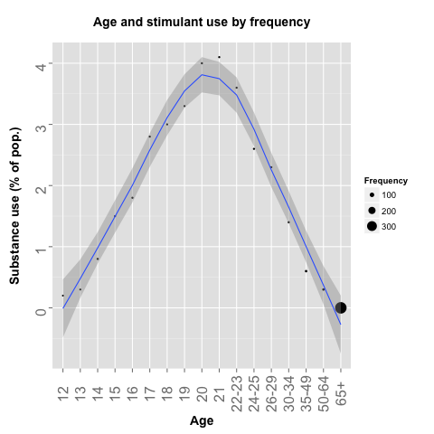

<h1>Drug Use and Frequency by Age</h1>

Which is the drug of the mass? And which ones have the loyal druggies? Below are graphs of 13 drugs and their popularity along different age groups. Notice that y-axis, the percentage in population is relative to the data spread, where alcohol is the most common drug of all.

<h3>Alcohol</h3>

<h3>Cocaine</h3>

<h3>Crack</h3>

<h3>Hallucinogen</h3>

<h3>Heroin</h3>

<h3>Inhalant</h3>

<h3>Marijuana</h3>

<h3>Meth</h3>

<h3>Oxycotin</h3>

<h3>Pain-reliever</h3>

<h3>Sedative</h3>

<h3>Stimulant</h3>

<h3>Tranquilizer</h3>
