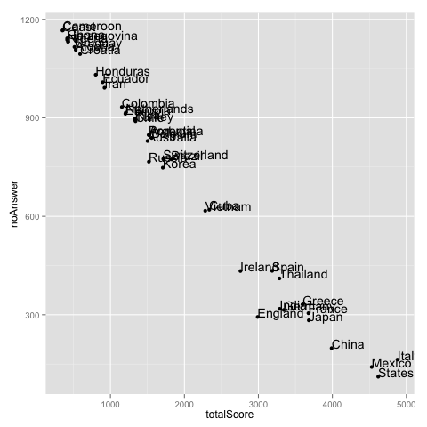
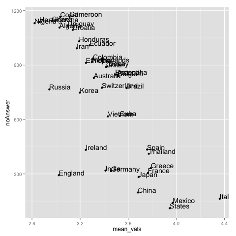
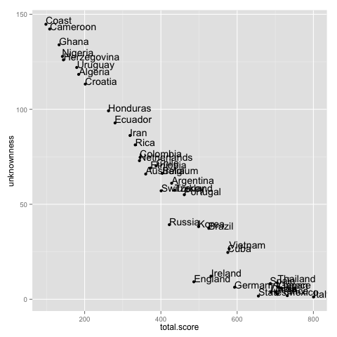
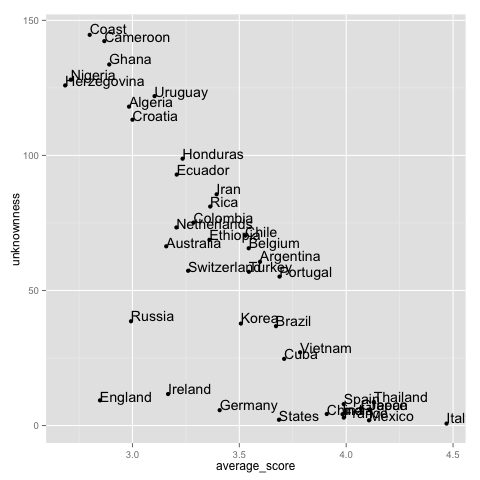
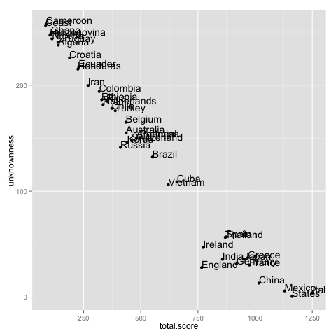
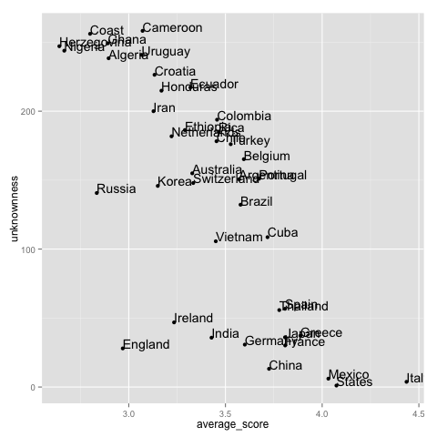

<h1>Food World Cup</h1>
<h2>Abstract</h2>

data analysis & visualisation of the data "food-world-cup", provided as an open-source data set by fivethrityeight.com. The plotted figures show that there exists almost linear inverse relationship between obscurity of a cuisine and its popularity. Upon segmentation with 3 dimensions - income, culinary skills/knowledge - we can see from the graphs there exist three different groups cuisines - absolutely unknown regional (Cameroon, Croatia), cuisines relatively relatable for Americans. This is corroborated by the concentration of Latin American cuisines in this group. The last groups are the qualifiers for the knock out rounds, the popular cuisines of Japan and Spain to Italy and Mexican.

<h2>Python Cleaner</h2>
Python cleaner reads in the file, changes the each column's header question for the country cuisine to simply the country name.  

"Please rate how much you like the traditional cuisine of (name)." => "(name)"
  
There are 48 columns. I delete the respondent ID, So I will output csv with 47 columns with the subsequent data attached to the respective column
with cleanUp.csv.

<h2>R Clean up</h2>
I prefer to use R to do heavylifting. All the factor columns are so defined, and we substitute all the "N/A" and "" (empty vals) with factor NA
I am also deleting the respondent with 40 or more missing answers, because these are essentially incomplete surveys. 
<h2>Visualisation</h2>

<h4>Jitter graph total score, n = 1282</h4> 
exhibits an obvious inverse relationship. The more reknown the cuisine is, the higher the raw score, and lower the unknownness. We can also see that there is a gap between Cuban/Vietnamese cuisines and the other cuisines in the right-bottom corner of the graph. In this region we find all the cuisines that are perhaps more familiar to Americans - Irish, Spanish to Mexican and Italian. This suggests a confounding error we may commit should we take it to the face value the observations from the graph. This is because the graph may be severly swayed by the taste-buds of Americans only. (maybe I see this as a source of error because I'm not American) Let us look at the graph where we plot unknownness vs. average score. Average score is calculated by dividing total score gained by each country by the number of respondents that gave a score to a respective cuisine.

<h4>Jitter graph of mean score, n = 1282</h4>
The above graph shows that if we weight the total score by the number of respondents, the cuisines such as English, German, and Russian slide to the left. This is because even though Americans are rather familiar with these cuisines, they are also known to be less tasty cuisines compared to the likes of Mexican, Chinese, and Italian. The countries that stay in bottom_right corner in this graph as well are the cuisines that we may have guessed: Japanese, Greek, French, Chinese, Mexican, Italian, followed by lesser-known, yet equally high-scoring Thai and Spanish cuisines.

<h2>Segmentation</h2>
The countries named above are the most popular when we use the entire data. I'm curious if this would change if we segment the population with three different dimensions: income, culinary skills, and knowledge. All these are self-reported, so I'm not sure what to expect.
<h3>The connoisseurs</h3>

<h4>Jitter graph total score, n = 180</h4>

<h4>Jitter graph of mean score, n = 180</h4>
The data consist of 180 respondents who reported the highest(shown as "Advanced") culinary knowledge. We observe that, first, the unweighted total score graph above shows that the concavity that was observed when we ploted the whole data(n = 1282) has more or less disappeared. This is because in this segmented data, connoisseurs tend to know and give normally distributed scores to relatively obscure cuisines, bringing down the lesser-known cuisines collection to the right-down direction. The relationship between the unknownness and totalScore is virtually linear. Here again, English and Irish cuisines are the glaring underperformers.   
The average graph, on the other hand, reveals that the spread is wider than that of total mean score. It's interesting that the clear underperformers that are placed well within the mainstream belt are the expected ones: English, Irish, German, and Russian. These are all cold countries where the lack of variety of ingredients have been wanting for much of human history up to modernity.   

Here are the other two segmentations, by income bracket and culinary skills. The general observations are the same in a sense that the obvious underperformers and outliers are more or less the same cuisines.
<h3>The Rich</h3>

<h4>Jitter graph total score, n = 286</h4>

<h4>Jitter graph of mean score, n = 286</h4>
<h3>... and the chefs</h3>

<h4>Jitter graph total score, n = 408</h4>

<h4>Jitter graph of mean score, n = 408</h4>

for more information, email me at sunghoonyang@berkeley.edu
