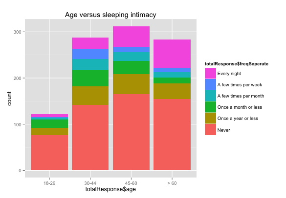
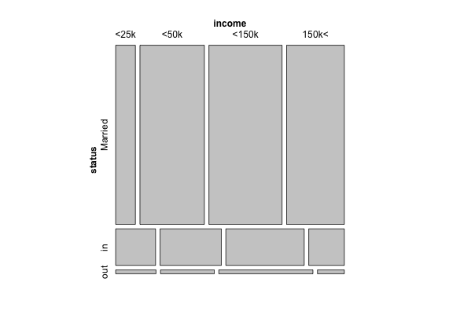
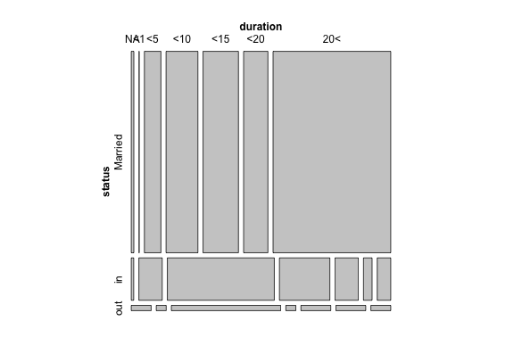
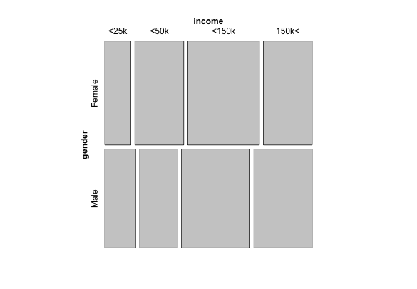
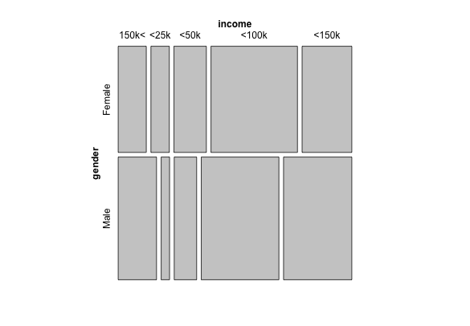

<h1>Are You Sleeping Alone?</h1>
<h2>Understanding the Population</h2>

<h4>Age vs. Sleeping Intimacy</h4>

counts of respondents by age group bins. Bars are divided by the varying frequencies of sleeping separately

<h4>Marriage Status vs. Household Income</h4>

Married couple seem to be financially better-off. They are older than both groups that are in and out of relationship, and thus make more money - <i>circle of life</i>

<h4>Marriage Status vs. Length of Relationship</h4>

The striking is not saying much - married couples exhibit longer duration of marriage. Among the people who are currently out of relationship, the  majority of them have recorded relationship duration being shorter than 5 years, and people who are now out of relationship and had one lasting over 10 years are much fewer than those of other two status segments.

Below are two mosaics comparing female male incomes for the respondents who answered that they sleep each day seperately and together respective.

<h4>Income Gender mosaic for people who sleep seperately everyday</h4>

<h4>Income Gender mosaic for people who never sleep seperately</h4>

Notice how men that have reported that they sleep seperately with the partner exhibit the income distribution that is highest on average. These men generally earn a greater amount than both their female counterpart, and also males counterpart who responded "never" for frequency of seperation.
