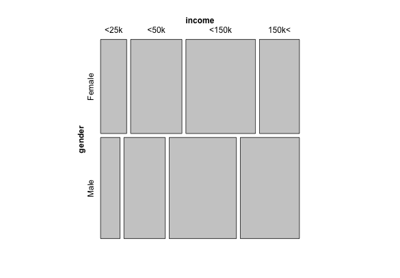

<h1>Are You Sleeping Alone?</h1>
<h3>Understanding the Population</h3>

<h4>Marriage Status vs. Household Income</h4>

<h4>Marriage Status vs. Length of Relationship</h4>

Married couples exhibit longer duration of marriage. DUH. So if "in a relationship" people's data would be more revealing if we compare it to that of "out of relationship" people, if we pivot around duration

<h4>Income Gender mosaic for people who sleep seperately everyday</h4>

<h4>Income Gender mosaic for people who never sleep seperately</h4>

<h4>Age vs. Sleeping Intimacy</h4>
