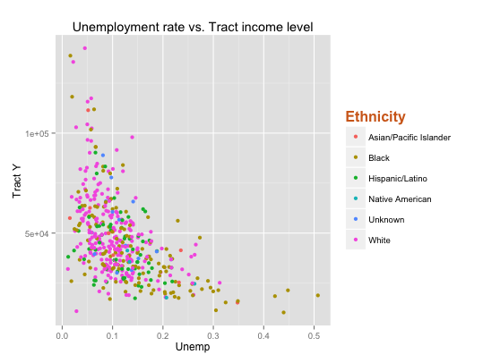
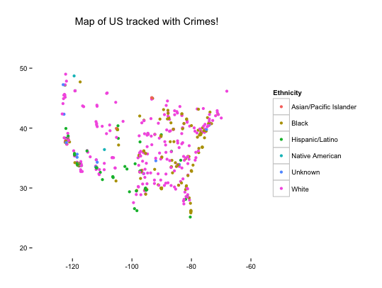

<h1>Police Killing</h1>

<h3>Crime where you fit in!</h3>

higher tract income may be the confounding factor, as not as many black or other races tend to live in the same neighborhood. So higher income tracts' crimes are committed by white. The higher the unemployment and the lower the tract income level the more obvious the crimes committed by Blacks as opposed to other ethnicities. 

<h3>Turf war - save whites</h3>

Hispanic/Latino police killings most seen in the south, black deaths are concentrated in the Eastern half. White deaths are the only prevalent one throughout the states for the obvious reason that they form the majority of the population. 
